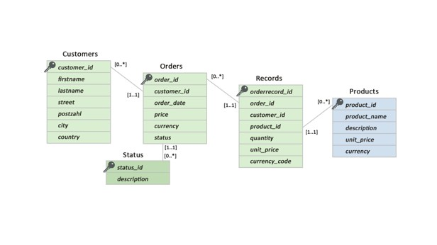
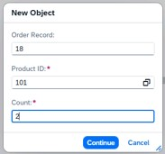
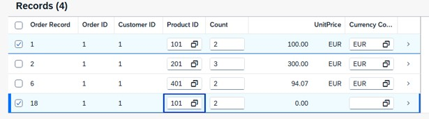
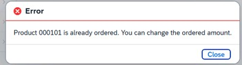
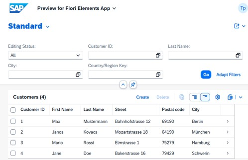
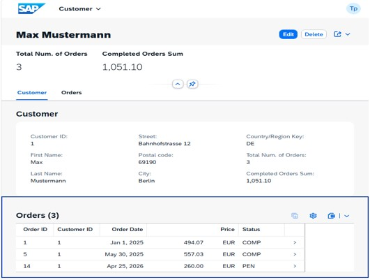
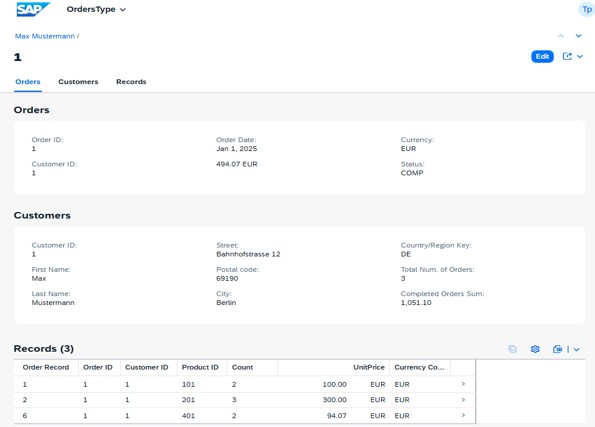

# SAP Customer Revenue Analytics Application

## Overview

This project was developed as a case study during an SAP ABAP Cloud training program.

The application provides a centralized analytics platform for customer, order, product, and revenue data using modern SAP cloud technologies.

Built on SAP BTP using ABAP Cloud, RAP, CDS Views, OData V4, and SAP Fiori Elements, the solution enables users to analyze business data through a responsive and user-friendly interface.

---

## Business Problem

Many organizations lack a centralized overview of customer and revenue information.

Typical challenges include:

* Customer and sales data distributed across multiple sources
* Time-consuming manual reporting
* Limited visibility into customer performance
* Difficult identification of high-value customers and products

### Goal

Develop a modern cloud-based SAP Fiori application that provides:

* Customer overview
* Order management
* Product analysis
* Revenue analytics
* Easy navigation between related business entities

---

## Solution Architecture

```text
SAP HANA Database
        │
        ▼
     CDS Views
        │
        ▼
   RAP Business Objects
        │
        ▼
   OData V4 Services
        │
        ▼
 SAP Fiori Elements UI
```

---

## Technologies Used

### SAP Technologies

* SAP BTP ABAP Environment
* ABAP Cloud
* SAP HANA
* RAP (RESTful Application Programming Model)
* CDS Views
* OData V4 Service Binding
* SAP Fiori Elements

### Development Tools

* Eclipse ADT
* Git
* GitHub

---

## Data Model

The application is based on the following business entities:

### Customer

Stores customer master data.

### Orders

Stores customer orders.

### Order Items

Stores individual order positions.

### Products

Stores product information and pricing data.

### Relationships

* Customer → Orders
* Order → Order Items
* Order Items → Products
  


CDS Associations are used to establish navigation between business objects and support Fiori UI navigation.

---

## Business Logic

The application contains several analytical calculations:

### Revenue Calculation

* Automatic revenue calculation
* Revenue aggregation by customer
* Revenue aggregation by product

### Validations

The application uses RAP validations to ensure data consistency before saving business data.
Implemented validations include:

* Product Type Validation in Order Records.




  
* Quantity must be greater than zero
* Unit price must be greater than zero
* Order date must not be in the future
* Customer reference must be valid
* Product reference must be valid
* Negative revenue values are not allowed

  
### Customer Classification

Customers are categorized based on order volume and business activity.

### Revenue Rules

Only paid orders are included in revenue calculations to ensure accurate business reporting.

---

## Application Features

### Customer Overview

* Customer list report
* Revenue-based sorting
* Status indicators
* Filtering capabilities
* Navigation to customer details

### Customer Details

* General Information
* Address Information
* Contact Information
* Notes Section
* Related Orders



Implemented using Fiori Facets and annotation-driven UI design.

### Orders

* Order overview
* Order status display
* Order date information
* Total order value calculation
* Navigation to order items



### Order Items

* Product information
* Quantity
* Unit price
* Calculated line total



### Revenue Analytics

* Revenue by customer
* Revenue by product
* Revenue aggregation
* Revenue filtering
* KPI-oriented business insights

---

## Technical Highlights

### ABAP RAP

* Managed Business Objects
* Behavior Definitions
* Service Definitions
* Service Bindings

### CDS Views

* Data Modeling
* Associations
* Analytical Calculations
* UI Annotations

### Fiori Elements

* List Report
* Object Page
* Facets
* Annotation-driven UI

---

## Challenges & Learnings

During the implementation the following topics were explored:

* RAP architecture and development model
* Complex CDS associations
* Fiori Elements behavior
* Annotation-based UI development
* Revenue calculation logic
* Test data consistency
* Service exposure with OData V4

---

## Project Outcome

The project demonstrates how SAP ABAP Cloud and RAP can be used to build scalable and maintainable enterprise applications on SAP BTP.

Key results:

* Modern cloud-native SAP application
* Structured customer and revenue analytics
* Responsive Fiori user experience
* Clean RAP architecture
* Extensible and maintainable solution design

---

## Screenshots

Add screenshots of:

1. Customer List Report
2. Customer Object Page
3. Orders Overview
4. Order Items Overview
5. Revenue Analytics Page

---

## Author

Muster Musterman

Junior SAP ABAP Developer

SAP ABAP Cloud | RAP | CDS Views | OData V4 | SAP BTP
